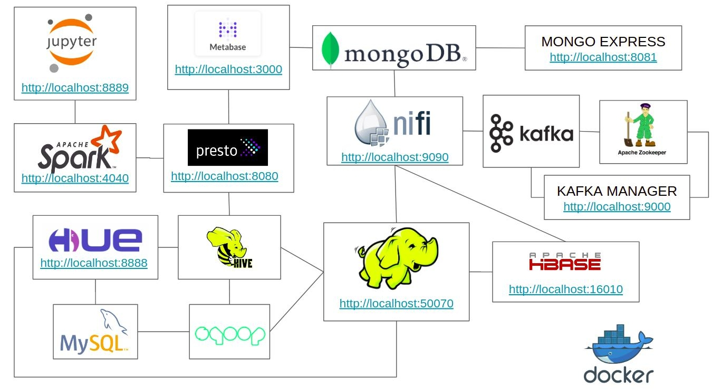
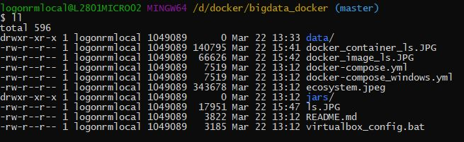
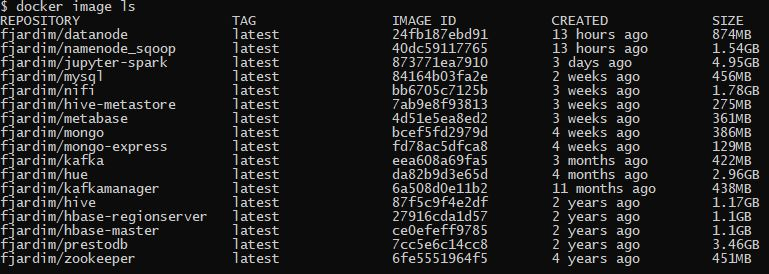
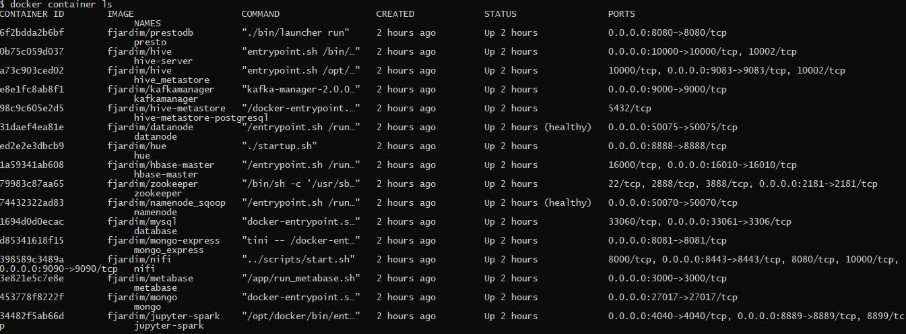

  

<h1 align="center">Olá 👋, eu sou o Johrel!!!</h1>
<h3 align="center">Trabalho com BI e sou graduando na pós da PUC-Minas na área de Ciência de Dados e Big Data</h3>

- 🔭 Atualmente trabalho como Analista de BI no **projeto de risco operacional do Bradesco**

- 🌱 Estou aprendendo sobre **ML, MlOps, DevOps, DeepLearning, IA, Engenharia de Dados, Engenharia de IA e Big Data.**

- 💬 Me pergunte sobre **BI, Microstrategy, Power BI, SAS, SQL, Python, R e tudo que envolva tecnologia no geral, se eu não souber, buscamos no ChatGPT! haha!!**

- 📫 Como entrar em contato comigo: **jhouers@gmail.com**

- ⚡ Curiosidades sobre min: **Eu sou músico, pedreiro, encanador, eletricista, soldador, pintor, projetista, designer, cozinheiro amador e muito mais.. kkkkk**

<h3 align="left">Connect with me:</h3>

<h3 align="left">Languages and Tools:</h3>

                                     

<a href="https://github.com/johrel">

<h1 align="center"># BIG DATA ECOSYSTEM COM DOCKER</h1>

Ambiente para estudo dos principais frameworks big data em docker.
  Esse setup vai criar dockers com os frameworks HDFS, HBase, Hive, Presto, Spark, Jupyter, Hue, Mongodb, Metabase, Nifi, kafka, Mysql e Zookeeper com a seguinte arquitetura:
 

## SOFTWARES NECESSÁRIOS
#### Para a criação e uso do ambiente vamos utilizar o git e o Docker 
   * Instalação do Docker Desktop no Windows [Docker Desktop](https://hub.docker.com/editions/community/docker-ce-desktop-windows) ou o docker no [Linux](https://docs.docker.com/install/linux/docker-ce/ubuntu/)
   *  [Instalação do git](https://git-scm.com/book/pt-br/v2/Come%C3%A7ando-Instalando-o-Git)
   
## SETUP
*OBS: Esse passo deve ser realizado apena uma vez. Após o ambiente criado, utilizar o docker-compose para iniciar os containers como mostrado no tópico INICIANDO O AMBIENTE*

#### Criação do diretório docker:
*OBS: Criar um diretório chamado docker*

   *  Sugestão no Windows:
      *  Criar na raiz do seu drive o diretório docker
         ex: C:\docker
          
   * Sugestão no Linux:
      * Criar o diretório na home do usuário
        ex: /home/user/docker

#### Em um terminal/DOS, dentro diretório docker, realizar o clone do projeto no github
          git clone https://github.com/Johrel/Projeto_Kafka.git
          
#### No diretório Projeto_Kafka vai existir os seguintes objetos

   
## INICIANDO O AMBIENTE
   
  *No Windows abrir PowerShell, do Linux um terminal*

### No terminal, no diretorio Projeto_Kafka executar o docker-compose
          docker-compose up -d        

### Verificar imagens e containers
 
         docker image ls

         docker container ls

## SOLUCIONANDO PROBLEMAS 
   
  *No Windows abrir o Docker Quickstart Terminal*

### Parar um containers
         docker stop [nome do container]      

### Parar todos containers
         docker stop $(docker ps -a -q)
  
### Remover um container
         docker rm [nome do container]

### Remover todos containers
         docker rm $(docker ps -a -q)         

### Dados do containers
         docker container inspect [nome do container]

### Iniciar um container
         docker-compose up -d [nome do container]

### Iniciar todos os containers
         docker-compose up -d 

### Acessar log do container
         docker container logs [nome do container] 

## Acesso WebUI dos Frameworks
 
* HDFS *http://localhost:50070*
* Presto *http://localhost:8080*
* Hbase *http://localhost:16010/master-status*
* Mongo Express *http://localhost:8081*
* Kafka Manager *http://localhost:9000*
* Metabase *http://localhost:3000*
* Nifi *http://localhost:9090*
* Jupyter Spark *http://localhost:8889*
* Hue *http://localhost:8888*
* Spark *http://localhost:4040*

## Acesso por shell

   ##### HDFS

          docker exec -it datanode bash

   ##### HBase

          docker exec -it hbase-master bash

   ##### Sqoop

          docker exec -it datanode bash
        
   ##### Kafka

          docker exec -it kafka bash

## Acesso JDBC

   ##### MySQL
          jdbc:mysql://database/employees

   ##### Hive

          jdbc:hive2://hive-server:10000/default

   ##### Presto

          jdbc:presto://presto:8080/hive/default

## Usuários e senhas

   ##### Hue
    Usuário: admin
    Senha: admin

   ##### Metabase
    Usuário: bigdata@class.com
    Senha: bigdata123 

   ##### MySQL
    Usuário: root
    Senha: secret
   
   ##### MongoDB
    Usuário: root
    Senha: root
    Authentication Database: admin

## Documentação Oficial

* https://zookeeper.apache.org/
* https://kafka.apache.org/
* https://nifi.apache.org/
* https://prestodb.io/
* https://spark.apache.org/
* https://www.mongodb.com/
* https://www.metabase.com/
* https://jupyter.org/
* https://hbase.apache.org/
* https://sqoop.apache.org/
* https://hadoop.apache.org/
* https://hive.apache.org/
* https://gethue.com/
* https://github.com/yahoo/CMAK
* https://www.docker.com/

## 
## Para replicar esse projeto/treinamento, você pode começar criando uma pasta local, e depois clonar este repositório dentro da mesma. Após clonar o repositório, podemos iniciar o docker e dar sequência utilizando os comandos abaixo.
  Os comandos que utilizamos para dar início ao Kafka foram estes:
  
  Aqui subimos o container do Kafka:
  
    ● Iniciando o Docker: docker-compose up -d kafka 
  
  Após subir o container e garantir que ele está rodando, podemos entrar no bash:
  
    ● Acesso ao host kafka: docker exec -it kafka bash 
  
  Dentro do bash, podemos alterar o diretório até a pasta bin, para então poder criar os tópicos:
  
    ● Diretório da Kafka: /opt/kafka/bin
  
  Após acessar o diretório bin, você precisa utilizar o script kafka-topics no diretório bin, para criar os novos tópicos:
  
  O comando utilizado para a criação de tópicos é esse:
  
     ./kafka-topics.sh --create --zookeeper zookeeper:2181 --replication-factor 1 --partitions 1 --topic <nome-do-topico> 
   
   Onde: 
    
   --zookeeper é o conjunto de zookeeper
    
   --replication-factor é o número de réplica para o tópico 
    
   --partitions é o número de partições desejado para aquele tópico 
    
   --topic é o nome do tópico a ser criado 
    
  Ao criar um tópico, é exibida a mensagem: Created topic (nome-do-topico).
    
  Para listar os tópicos existentes utilizamos o comando abaixo: 
  
    ./kafka-topics.sh --list --zookeeper zookeeper:2181 
  
  Para verificar as configurações do tópico: 
  
    ./kafka-topics.sh --describe --zookeeper zookeeper:2181 --topic <nome-do-topico>
  

## Agora que já sabemos criar tópicos utilizando o Kafka, vamos utilizar o “producer” para criar mensagens em realtime, e em outro terminal, utilizar o “consumer”, que irá receber as mensagens criadas pelo “producer” instantaneamente.

Para isso vamos usar os comandos abaixo: 

    ./kafka-console-producer.sh --broker-list kafka:9092 --topic <nome-do-topico>

Após a abertura do “producer”, basta digitar as mensagens.

Em outro terminal, vá até o diretório bin novamente e execute o “consumer”.

    ./kafka-console-consumer.sh --bootstrap-server localhost:9092 --topic <nome-do-topico> --from-beginning

Ao iniciar o consumer, todas as mensagens serão recebidas no console. Inclusive as mensagens enviadas antes da abertura do consumer.

Obs: Por padrão, a porta utilizada pelo Kafka Broker é a 9092, podendo ser alterada no arquivo de configuração. 

## Depois de fazermos o envio e recebimento utilizando o terminal, podemos fazer também o mesmo, porém, utilizando Python. 

**Dentro do repositório você vai encontrar os scripts: Producer e Consumer.**

Para criar novas mensagens através do Python, você vai precisar criar um tópico no console. Eu criei o tópico chamado “teste”. Por isso, ao abrir o script, você vai encontrar no código o seguinte: topic='teste'.

Mas você pode criar com o nome que preferir. 

Com isso terminamos nosso treinamento de mensageria utilizando o Apache Kafka. Como podem ver, é algo introdutório e que nos foi apresentado durante o curso de pós-graduação em Ciência de Dados e Big Data da PUC-Minas.

**Obrigado a todos e até!!!**

